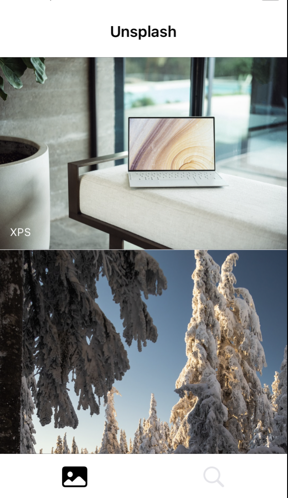
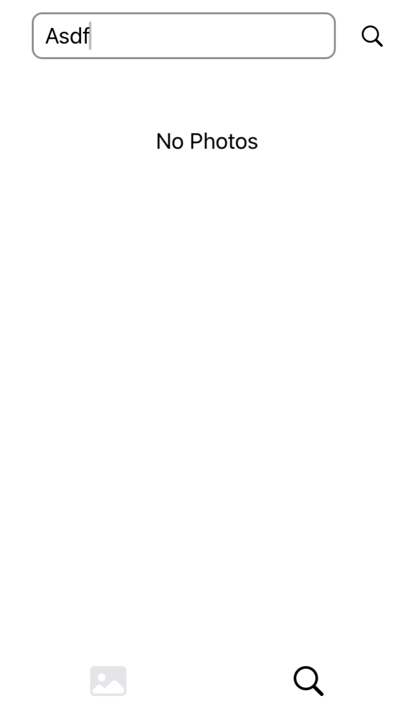

# iOS-Programming_Team Project

#### 7조: 이승원, 김예진, 오세원, 최수완, 이희선

#### 주제: 고정주제

##### 주요 기능

- 두 개의 탭(메인 탭, 검색 탭)으로 구성되어 있다.
- 앱 구동 시 메인 화면에서 **`Unsplash`**의 `Editorial` 사진들을 볼 수 있다.
- 스크롤에 따라 사진이 자동으로 로드된다.
- 사진을 터치하여 상세보기 화면을 띄운다.
- 상세보기 화면에서 스와이프 동작을 통해 목록의 다음/이전 이미지를 볼 수 있다.
- 검색어를 입력하고 돋보기 아이콘을 터치하여 검색된 사진들의 목록을 볼 수 있다.
- 탭을 이동하거나 상세보기 화면을 띄우더라도 각 탭의 스크롤의 위치는 유지된다.

##### 오픈소스 이용

- `Kingfisher`
  URL String을 이미지로 변환하기 위해 해당 라이브러리를 이용하였다. 

##### 디자인

- 실제 **`Unsplash`** 앱에는 다크 모드의 구분이 없으나, `Color Assets`를 활용하여 다크 모드가 따로 있다고 가정하고 구현하였다.

- 메인화면

  

- 상세 화면

  

- 검색 화면

  

- 검색된 사진이 없음
  

##### Models

- `MediaResponse`
  사진의 고유한 `id`와, `urls` 중 `regular` 크기를, `user` 정보 중 `name`을 이용하였다.
- `Program`
  - 스크롤과 검색에 따라 사진들을 받아오기 위한 로직이 구현되어 있다.
  - `fetchPhoto()`: 처음 앱이 실행될 때, 이후 메인 탭에서 스크롤할 때 사용된다.
  - `fetchSearchedPhoto()`: 검색어를 이용하여 사진들을 검색할 때 사용된다.

##### Views

- `ContentView`
  - `TabView`를 이용하여 메인 탭과 검색 탭을 구성하였다. `tabItem`의 위치를 조정하는 것이 불가능하여 `Button`을 사용하였다.
  - 메인 탭: 앱의 이름, `PhotoListView()`(메인 탭의 사진 목록)
  - 검색 탭: 검색 바, `SearchListView()`(검색 탭의 사진 목록)
- `ModalView`
  - 사진을 터치했을 때 나오는 상세화면이다.
  - `ModalTopView`: 상세화면을 닫는 기능이 있고, 이미지 업로더의 이름이 가운데에 표시된다. 공유 버튼의 기능은 구현되지 않았다.
  - `Image`에는 `.aspectRatio(contentMode: .fit)` 속성을 적용하였다.
  - `ModalFooterView`: 실제로 구현된 기능은 없다.
- `ListView`
  - 메인 탭과 검색 탭의 사진 목록을 구현한다.
  - `PhotoListView()`
    - `List`를 이용하여 사진 목록을 표현하였고, `ZStack`을 이용하여 사진 위에 이미지 업로더의 이름이 표시되도록 하였다.
    - `.onAppear`를 이용하여 마지막에서 5번째 사진이 화면에 등장할 때 다음 페이지의 사진 목록을 받아오도록 하였다.
  - `SearchListView()`
    - `ScrollView`, `LazyVGrid`, `ForEach`를 이용하여 사진이 두 행으로 나타나도록 하였다. 
    - 사진의 너비와 길이가 스크린 너비의 절반이 되도록 하기 위해 `GeometryReader`를 이용하였다.
    - 나머지 디자인과 사진을 자동으로 받아오는 기능은 `PhotoListView()`와 동일하다.

